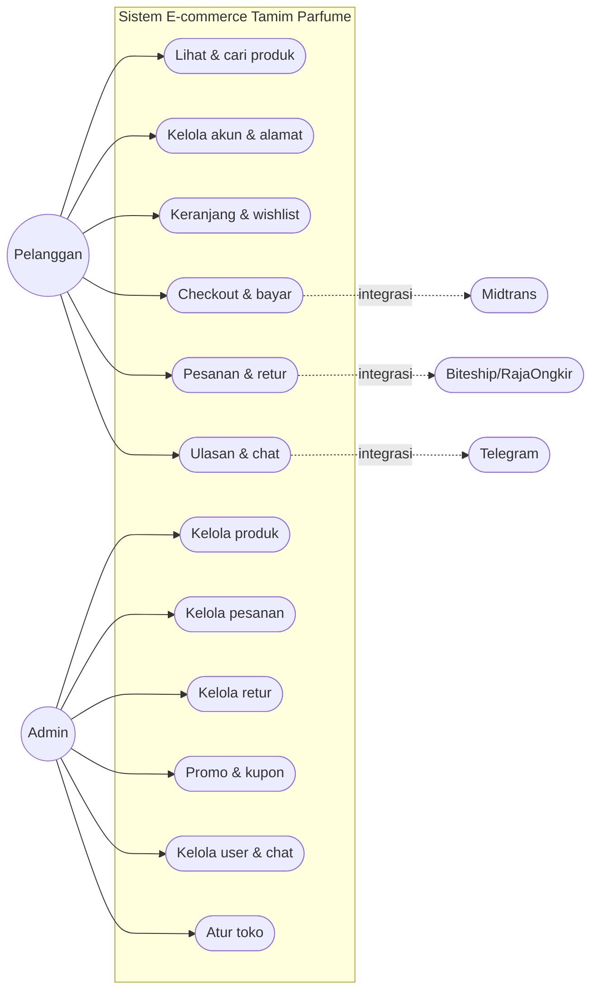

# Use Case & Database Tamim Parfume

## Diagram Use Case

## Daftar Tabel Database

1. `profiles`
2. `password_reset_otps`
3. `categories`
4. `products`
5. `product_images`
6. `product_variants`
7. `orders`
8. `order_items`
9. `order_coupons`
10. `addresses`
11. `coupons`
12. `promos`
13. `wishlist`
14. `reviews`
15. `chat_conversations`
16. `chat_messages`
17. `store_settings`
18. `hero_slides`
19. `returns`
