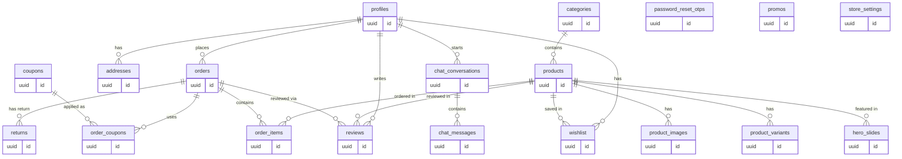

# Use Case & Database Tamim Parfume

## Diagram Use Case

```mermaid
flowchart LR
    Pelanggan((Pelanggan))
    Admin((Admin))

    subgraph Sistem[Sistem E-commerce Tamim Parfume]
        UC1([Lihat & cari produk])
        UC2([Kelola akun & alamat])
        UC3([Keranjang & wishlist])
        UC4([Checkout & bayar])
        UC5([Pesanan & retur])
        UC6([Ulasan & chat])

        UC7([Kelola produk])
        UC8([Kelola pesanan])
        UC9([Kelola retur])
        UC10([Promo & kupon])
        UC11([Kelola user & chat])
        UC12([Atur toko])
    end

    Pelanggan --> UC1
    Pelanggan --> UC2
    Pelanggan --> UC3
    Pelanggan --> UC4
    Pelanggan --> UC5
    Pelanggan --> UC6

    Admin --> UC7
    Admin --> UC8
    Admin --> UC9
    Admin --> UC10
    Admin --> UC11
    Admin --> UC12

    UC4 -.->|integrasi| Midtrans([Midtrans])
    UC5 -.->|integrasi| Biteship([Biteship/RajaOngkir])
    UC6 -.->|integrasi| Telegram([Telegram])
```

## Daftar Tabel Database

```mermaid
erDiagram
    profiles ||--o{ orders : places
    profiles ||--o{ addresses : has
    profiles ||--o{ wishlist : has
    profiles ||--o{ reviews : writes
    profiles ||--o{ chat_conversations : starts

    categories ||--o{ products : contains

    products ||--o{ product_images : has
    products ||--o{ product_variants : has
    products ||--o{ order_items : "ordered in"
    products ||--o{ wishlist : "saved in"
    products ||--o{ reviews : "reviewed in"
    products ||--o{ hero_slides : "featured in"

    orders ||--o{ order_items : contains
    orders ||--o{ order_coupons : uses
    orders ||--o{ reviews : "reviewed via"
    orders ||--o{ returns : "has return"

    coupons ||--o{ order_coupons : "applied as"

    chat_conversations ||--o{ chat_messages : contains

    profiles {
        uuid id
    }
    password_reset_otps {
        uuid id
    }
    categories {
        uuid id
    }
    products {
        uuid id
    }
    product_images {
        uuid id
    }
    product_variants {
        uuid id
    }
    orders {
        uuid id
    }
    order_items {
        uuid id
    }
    order_coupons {
        uuid id
    }
    addresses {
        uuid id
    }
    coupons {
        uuid id
    }
    promos {
        uuid id
    }
    wishlist {
        uuid id
    }
    reviews {
        uuid id
    }
    chat_conversations {
        uuid id
    }
    chat_messages {
        uuid id
    }
    store_settings {
        uuid id
    }
    hero_slides {
        uuid id
    }
    returns {
        uuid id
    }
```
